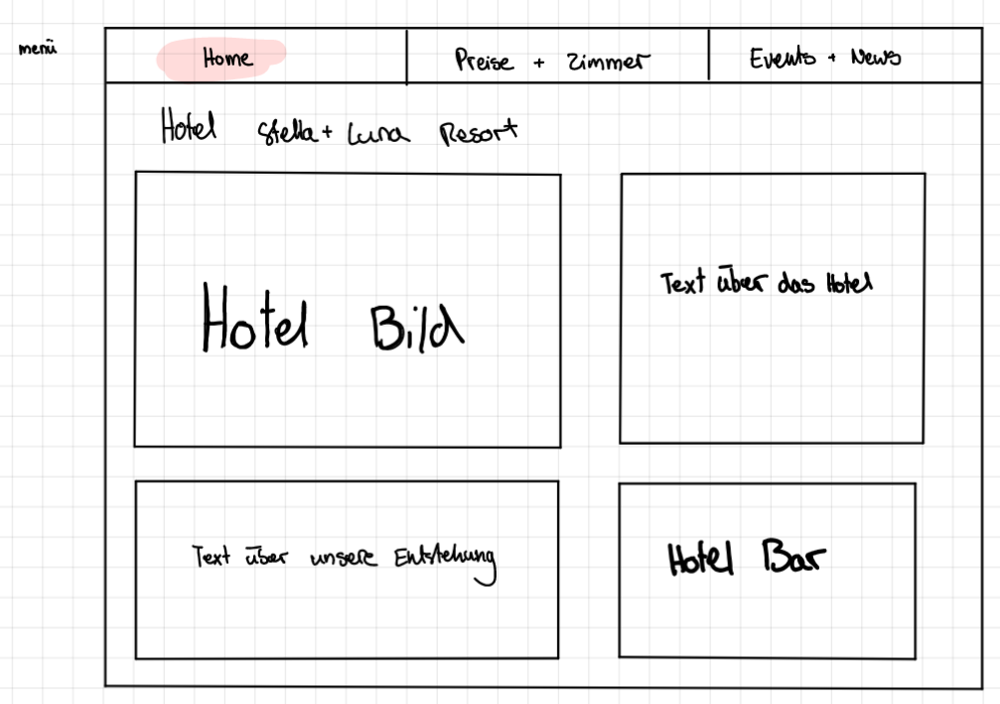
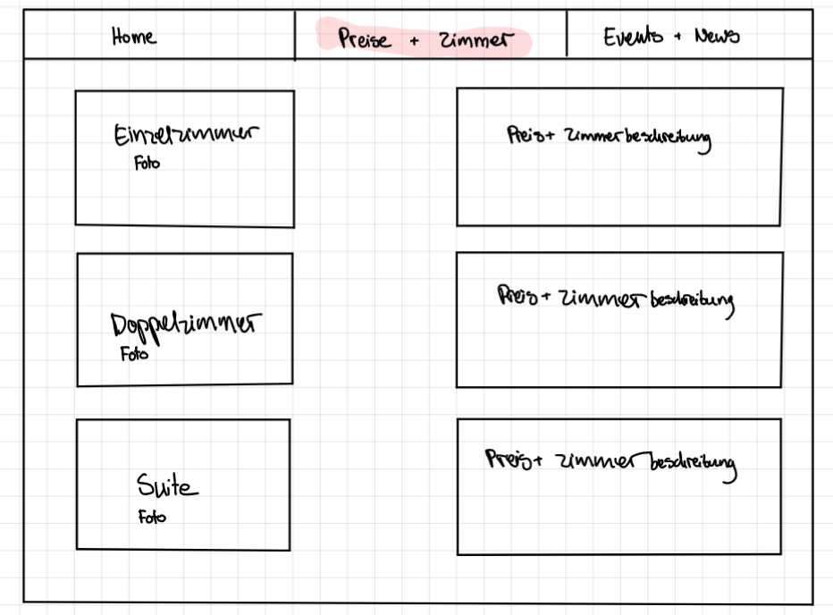

# Hotel Stella und Luna Resort
Unsere Webiste trägt den Namen **"Stella und Luna Resort."**
Es handelt sich dabei um ein Hotel in den Malediven. 
Dieser Name wurde gewählt, weil man sich dort Tag und Nacht wohlfühlen und Entspannen kann. Stella steht für die warme Sonne die auf die Haut strahlt und den Körper nach einem abkühlendem Schwum im Meer wärmen soll. Luna stellt den Mond dar, in unserem Fall dich Nacht. Denn wenn die Sonne eindämmert fängt das abenteurische "Partyleben" an.
Dieses Hotel bietet ihnen eine "allround"- Verpflegung an. Von "late night"- Massagen bis über Schnorchelkürse ist für jeden etwas dabei.
## Projektplan

Detaillierte Beschreibung der geplanten Funktionalität.
Auf der Home Seite wird das Hotel und die Entstehungsgeschichte unseres Familienbetriebs erläutert. Dazu sieht man rechts von dem Text über das Hotel eine Abbildung von unserem Hotel. Unter dem steht der Text über die Entstehungsgeschichte und rechts davon eine Abbildung vom Herz des Hotels.   

Die zweite Seite zeigt die individullen Hotelzimmer Möglichkeiten und deren Preise pro Person pro Nacht. Jedes Hotelzimmer hat seine Einzigartigkeit, diese wird mit den anlockenden Abbildungen dem Kunden näher gebracht. Zu unterst auf der dieser Seite findet man einen "Email-Button", der, wenn man ihn drückt, auf das "Mail"-Programm leitet und man somit direkt ein Zimmer buchen kann.

Auf der letzten Seite sind sich die spektakulären "Events und News" aus dem Hotel und der Umgebung zu finden. Diese sind so programmiert, dass man auf "Hier buchen" drücken kann und man sofort auf die dazugehörige Website, der Organisation, welche dies an unserem Strand durchführt, weiter geleitet wird. 

Auf jeder Seite sieht man einen "Footer", die unsere Kontaktdaten zu verfügung stellen, falls es zu Fragen kommen sollte. 


### Hauptseite **"Home"**
----

 
 
 Die **"Homeseite"**, auch Hauptseite, ist leicht verständlich gestaltet. Dabei war uns sehr wichtig das sie potentielle Kunden ansprechen könnte. Oben an der Website soll man das Menü und unterhalb sollte man einen "Footer" sehen.
 Man sollte ein selbst erstelltes Logo sehen und dazu zwei Bilder und Textabschnitte.

 Das erste Bild soll das Hotel zeigen, damit der Kunde schon beim ersten Blick sieht ob es ihm zuspricht. Der dazugehörige Text soll das Hotel summarisch beschreiben. 

 Das zweite Bild soll die Hotel Bar, welche wichtig für die Enstehungsgeschichte ist und darum weise dort platziert wurde zeigen. Daneben soll ein kurzer historischbedingter Text stehen.

### Unterseite 1 **"Zimmer und Preise"** 
---




Die erste Unterseite, bei uns **Zimmer und Preise** gennannt, soll dem Kunden die Übernachtungszimmer vorstellen. Wir haben uns für drei verschiedene Zimmerarten entschieden: 
- das Einzelzimmer 
- das Doppelzimmer 
- die Suite 

Dazu haben wir auch drei passende Bilder gewählt und drei beschreibende Texte je rechts neben dem Bild geplant. 

Wie bei der "Homeseite" soll diese ein Menü an der oben und am Ende einen "Footer" mit Kontaktdaten haben.

### Unterseite 2 **"Events und News"**
---


Die zweite Unterseite, bei uns **Events und News**, soll die extraordinären Angebote im und um das Hotel zeigen. Diese sollen getrennt angezeigt werden. Links sollen die Angebote im Hotel sein und rechts um das Hotel. Dazu soll man durch einen Link unter dem Bild aus der Katerogie "in der Umgebung" auf eine Seite kommen, wo man die abgebildete Aktivität buchen könnte. 
Bei der "im Hotel" Kategorie sollte ein Datum, Ort und eine Zeit angegeben werden, wo man kostenlos teilnehmen kann.  

Dazu soll man oberhalb das bedienbare Menü sehen und unterhalb den "Footer".

usw...

## Zeitplan

Zeitplan mit mindestens wöchentlichen Meilensteinen. Wann setzt wer etwas um?

| Deadline | Name | Beschreibung |
| --- | --- | --- |
| 10.05.2021 | Lara Schmid, Elena Lützelschwab | Menu erstellen |
| 13.05.2021 | Elena Lützelschwab| Text auf dem Home Seite |
| 13.05.2021 | Lara Schmid | Home Seite gestalten |
| 15.05.2021 | Lara Schmid, Elena Lützeschwab  | Unterseiten gestalten |
| 17.05.2021 | Lara Schmid, Elena Lützeschwab | Footer, Dokumentation beginnen|


## Umsetzung


### Hauptseite "Homeseite"

 

Screenshot mit Beschreibung.

### Unterseite 1 "Preise und Zimmer"

 
Screenshot mit Beschreibung.

### Unterseite 2 "Events und News"

 
Screenshot mit Beschreibung.

usw...

## Zusammenfassung

Zusammenfassung mit Vergleich zwischen Planung und Umsetzung. Was hat geklappt und was nicht? Konnte der Zeitplan eingehalten werden? Konnten die Skizzen umgesetzt werden?

Wir konnten gut unsere Pläne gut umsetzen, da wir eine gute Einteilung und Organisierung hatten. Unsere Zusammenarbeit hat hervorragend harmoniert.

Eine Problematik war die Zeit, die wir für die Unterseiten aufwenden mussten. Diese brauchten deutlich länger als die Hauptseite, da wir mehr Details und Verlinkungen eingeplant haben. 

Wir haben den Zeitplan teilweise nicht befolgt und haben spontan entschieden fortzufahren, da uns oft zufällig neue Ideen und Lösungsvorschläge eingefallen sind. Dadurch ist der Zeitplan auch nicht exakt geworden und oftmals haben wir auch am gleichen Laptop gearbeitet und somit nur jemand etwas auf GitHub "gepushed".  

Zwei Kleinigkeiten haben uns auch noch Mühe bereitet. Die erste war das "Pushen" auf GitHub, dies war für uns noch unklar anfangs. Die andere Kleinigkeit war, das uns bei diesem Dokument das Einfügen von unseren "Screenshots", schwer gefallen ist, doch nach dem wir unsere zuständige Lehrperson gefragt haben und sie uns dies erklärt hat , konnten wir diese Probleme beseitigen und gut fortfahren.

Unsere Skizzen stimmen sehr gut mit dem Endresulat überein. Wir haben sogar noch Ergänzungen hinzugefügt, da uns beim Programieren noch mehr Verbesserungsideen und Gesaltungsmöglichkeiten eingefallen sind. 


Im ganzen haben wir unsere Vorstellungen erfüllt und sind sehr zufrieden mit dem Ergebnis. 


---

Tipps zum README-Markdown:
- Eine Liste kann man einfach so schreiben
- Mit Rechtsklick auf `README.md`, `Open Preview` kann man eine Live-Vorschau des Textes sehen 
- So schreibt man *kursiv*, **fett** und beides ***fettkursiv***
- So kann man ein Bild einfügen: 
- So kann man einen Link einfügen [Linktext](https://google.com)

So kann `einzeiliger Code` eingefügt werden.

So kann mehrzeiliger Code eingefügt werden.
```
.test {
    background-color: blue;
}
```

- Weitere Hilfen gibt es hier: https://guides.github.com/features/mastering-markdown