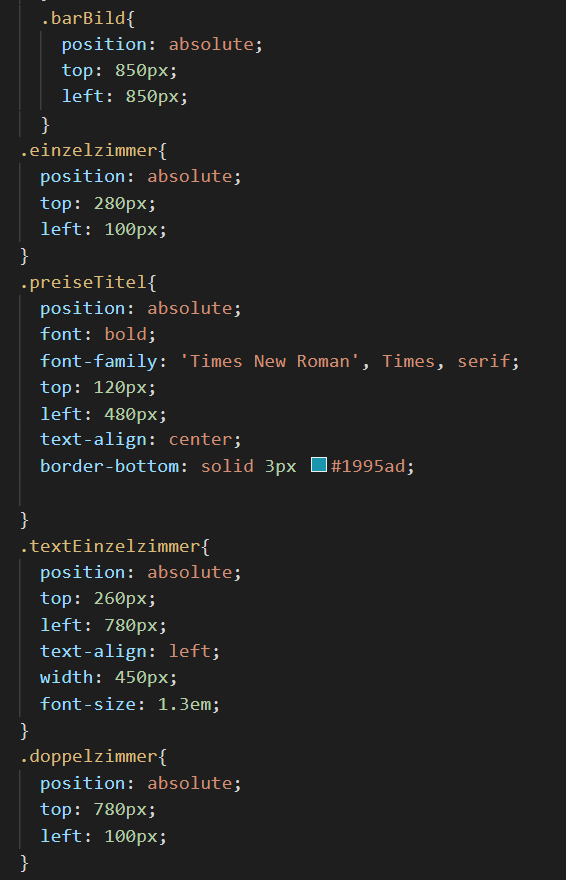

# Hotel Stella und Luna Resort
Unsere Website trägt den Namen **"Stella und Luna Resort."**
Es handelt sich dabei um ein Hotel in den Malediven. 
Dieser Name wurde gewählt, weil man sich dort Tag und Nacht wohlfühlen und entspannen kann. Stella steht für die warme Sonne, die auf die Haut strahlt und den Körper nach einer Abkühlung im Meer wärmen soll. Luna stellt den Mond dar, in unserem Fall die Nacht. Wenn die Sonne langsam untergeht, fängt das rauschende Partyleben an.
Das Hotel Stella und Luna Resort ist sehr bekannt für seine exzellente und ausgewogenen Küche. 
Auch das Wellness- und Freizeitprogramm lässt keine Wünsche offen... von "late night"- Massagen bis zu Schnorchelkursen ist für Jeden etwas dabei.
## Projektplan

Detaillierte Beschreibung der geplanten Funktionalität.
Auf der Home Seite wird das Hotel und die Entstehungsgeschichte unseres Familienbetriebs erläutert. Dazu sieht man rechts von dem Text über das Hotel eine Abbildung von unserem Resort. Darunter steht der Text über die Entstehungsgeschichte und rechts davon eine Abbildung vom Herz des Hotels.   

Die zweite Seite zeigt die geschmackvollen und individuell eingerichteten  Hotelzimmer und die Preise pro Person und Nacht. Jedes der sechzehn Hotelzimmer ist  einzigartig und wird mit den ansprechenden Bildern dem Gast näher gebracht. Am Ende dieser Seite findet man einen "Email-Button", der einem, wenn man ihn drückt,  auf das "Mail"-Programm leitet, wo direkt ein Zimmer gebucht werden kann.

Auf der letzten Seite sind "Events und News" aus dem Hotel und der Umgebung zu finden. Diese sind so programmiert, dass man auf "Hier buchen" drücken kann und man sofort auf die dazugehörige Website, der Organisation, welche diese Events am  Strand durchführt, weiter geleitet wird. 

Auf jeder Seite sieht man einen "Footer", mit unseren Kontaktdaten. 


### Hauptseite **"Home"**


 
 Die **"Homeseite"**, auch Hauptseite, ist leicht verständlich gestaltet. Dabei war uns sehr wichtig, dass diese potentielle Kunden anspricht. Oben an der Website soll man das Menü und unterhalb sollte man einen "Footer" sehen.
 Man sollte ein selbst erstelltes Logo sehen und dazu zwei Bilder und Textabschnitte.

 Das erste Bild soll das Hotel zeigen, damit der Kunde schon auf den ersten Blick sieht, ob es ihm entspricht. Der dazugehörige Text soll das Hotel summarisch beschreiben. 

 Das zweite Bild soll die Hotel Bar, welche wichtig für die Enstehungsgeschichte ist, und darum weise dort platziert wurde, zeigen. Daneben soll ein kurzer, historischbedingter Text stehen.

### Unterseite 1 **"Zimmer und Preise"** 
---


Die erste Unterseite, bei uns **Zimmer und Preise** gennannt, soll dem Kunden die individuell ausgestatteten Übernachtungszimmer vorstellen. Wir haben uns für drei verschiedene Zimmerarten entschieden: 
- das Einzelzimmer 
- das Doppelzimmer 
- die Suite 

Dazu haben wir auch drei passende und ansprechende Bilder gewählt und drei beschreibende Texte je rechts neben dem Bild geplant. 

Wie bei der "Homeseite" soll diese ein Menü oben und am Ende einen "Footer" mit Kontaktdaten haben.

### Unterseite 2 **"Events und News"**
---


Die zweite Unterseite, bei uns **Events und News**, soll die breiten Angebote im und um das Hotel zeigen. Diese sollen getrennt angezeigt werden. Links sollen die eigenen Angebote vom Hotel sein und rechts alle externen Angebote in der näheren Umgebung des Hotels.  Dazu soll man durch einen Link unter dem Bild aus der Katerogie "in der Umgebung" auf eine Seite kommen, wo man die abgebildete Aktivität gebucht werden kann. 
Bei der "im Hotel" Kategorie sollte ein Datum, Ort und eine Zeit angegeben werden, wo man kostenlos teilnehmen kann.  

Dazu soll man oberhalb das bedienbare Menü sehen und unterhalb den "Footer".


## Zeitplan

Zeitplan mit mindestens wöchentlichen Meilensteinen. Wann setzt wer etwas um?

| Deadline | Name | Beschreibung |
| --- | --- | --- |
| 10.05.2021 | Lara Schmid, Elena Lützelschwab | Menu erstellen |
| 13.05.2021 | Elena Lützelschwab| Text auf der Home Seite |
| 13.05.2021 | Lara Schmid | Home Seite gestalten |
| 15.05.2021 | Lara Schmid, Elena Lützeschwab  | Unterseite Zimmer/Preise gestalten |
| 17.05.2021 | Elena Lützelschwab | README schreiben| Unterseite Events und News |
| 22.05.2021 | Lara Schmid, Elena Lützeschwab | Footer, README beginnen|
| 26.05.2021 | Elena Lützelschwab | README schreiben|
| 29.05.2021 | Lara Schmid | Website verschönern|
| 29.05.2021 | Elena Lützelschwab, Lara Schmid | README fertig schreiben|


## Umsetzung


### Hauptseite "Homeseite"
Bild 1
 
Bild 2



Auf der Home Seite haben wir als erstes den Titel programmiert. Dazu haben wir auf der home.html Seite(Bild 1 oben) einen neuen div erstellt. In diesem div wurde eine neue Klasse mit dem Namen "indexTitel" eingerichtet. Mithilfe von diesem Namen konnten wir dann auf style.css (Bild 2 oben) versuchen, den Titel richtig zu platzieren, die richtige Grösse für ihn zu finden und die passende Farbe und Schriftart einzustellen. Ahnschliessend wurde das erste Bild des Hotels eingefügt. Dieses Bild haben wir auf Pinterest gefunden, heruntergeladen und mithilfe eines Programms in die richtige Grösse gebracht. Danach wurde es direkt in Visual Studio Code eingefügt(hotel3.png). Um das Bild nun auf der Webseite erscheinen zu lassen, wurde ein neuer div, eine neue Klasse und einen passenden Namen (startBild) auf home.html geschrieben. Das Bild wurde ebenfalls auf style.css richtig platziert. 
Direkt daneben wurde der erste Text auf unserer Webiste eingefügt. Für diesen Text wurde ebenfalls wieder einen neune div, eine neue Klasse und einen neuen Namen(BasicInfo) erstellt. Auf style.css wurde er in die richtige Position gebracht und erhielt die richtige Farbe und Grösse.  
Beim Text "überuns" und beim Bild "barBild" sind wir genau gleich vorgegangen wie bei den ersten beiden. Zum Schluss haben wir noch den Footer auf der Home Seite eingefügt(Bild 1 oben). Dieser wurde mit include-html eingefügt. Damit wird auf die html Seite des Footers (footer.html) zugegriffen und somit erscheint das, was auf der Footer Seite generiert wurde, auf der Home Seite der Webseite. Der Footer wurde so auf allen Seiten der Webseite eingefügt. Auch das Menu wurde so auf allen Seiten platziert. 
 
 

### Unterseite 1 "Preise und Zimmer"
Bild 1

Bild 2


Auf der ersten Unterseite "Preise und Zimmer" haben wir etwa das gleiche gemacht wie auf der Home Seite. Als erstes haben wir den Titel geschrieben und ihn anschliessend auf style.css platziert. Das selbe haben wir mit den drei Bildern und den Texten dazu gemacht. Die Bilder hatten wir ebenfalls auf Pinterest gefunden und anschliessend direkt eingefügt als Bild(doppezimmer.png, einzelzimmer.png und suite.png).
Für jeden Text, jedes Bild oder jeden Link wurde auf der dazugehörigen html Seite (preise.html) einen neuen div, eine neue Klasse und einen passenden Namen generiert. 
Alles wurde unter jenem Namen welcher auf der html Seite (preise.html) generiert wurde, auf style.css wieder verwendet damit man den Text oder das Bild richtig platzieren konnte.
Die richtige Grösse, Schriftart und passende Farbe wurde ebenfalls dort gewählt und programmiert. Bevor wir die Bilder dort in die richtige Position bringen konnten, haben wir mit Hilfe eines Programms die Bilder in die richtige Grösse gebracht, sodass sie alle etwa gleich gross waren. 
Auch auf dieser Seite wurde noch der Footer eingefügt. 
(Bild 1 oben)
Zum Schluss haben wir unten auf der Unterseite noch einen Button mit Hilfe von JavaScript eingefügt. Dieser wurde zuerst auf der html Seite "preise.html" programmiert(Bild 1 oben).Auf script.js wurde eingestellt, dass das Mail Fenster geöffnet wird und welche Email Adresse dabei verwendet werden soll(Bild 2 oben).


 


### Unterseite 2 "Events und News"
Bild 1


Bei unserer letzten Unterseite "Events und News" haben wir mit den beiden Titeln begonnen. Diese haben wir erneut auf der dazugehörigen html Seite (events.html) generiert mit Hilfe eines neune divs, einer neuen Klasse und eines neuen passenden Namens.
Unter dem selben Namen wurden anschliessend auf style.css die Titel wieder richtig platziert und farblich angepasst. Die vier Bilder wurden ebenfalls auf Pinterest gefunden und mit Hilfe eines Programms in die richtige Grösse gebracht und auf Visual Studio Code als Bilder eingefügt(restaurant.png, spa.png, schnorcheln.png, jetski.png). Auch diese wurden an die richtige Stelle auf der Webseite gebracht. Die Texte wurden passend zu den jeweilig dazugehörenden Bildern angepasst und oberhalb der Bilder in die richtige Position bewegt.
Die beiden dazugehörigen Links wurden mit einem neuen div, einer neuen Klasse, einem Namen und einem 
Tag um einen Link einzufügen, generiert. Hinter dem Link wird noch geschrieben was man statt des Links auf der Webseite sehen soll. (Beispiel Bild 1 bei "linkJetski")
Zum Schluss wurde noch der Footer eingefügt (Bild 1)


## Zusammenfassung

Zusammenfassung mit Vergleich zwischen Planung und Umsetzung. Was hat geklappt und was nicht? Konnte der Zeitplan eingehalten werden? Konnten die Skizzen umgesetzt werden?

Wir konnten unsere Pläne gut umsetzen, da wir eine gute Einteilung und Organisierung hatten. Unsere Zusammenarbeit hat hervorragend harmoniert.

Eine Problematik war die Zeit, die wir für die Unterseiten aufwenden mussten. Diese brauchten deutlich länger als die Hauptseite, da wir mehr Details und Verlinkungen eingeplant haben. 

Wir haben den Zeitplan teilweise nicht befolgt und haben spontan entschieden fortzufahren, da uns oft zufällig neue Ideen und Lösungsvorschläge eingefallen sind. Dadurch ist der Zeitplan auch nicht exakt geworden und oftmals haben wir auch am gleichen Laptop gearbeitet, so dass meist nur jemand etwas auf GitHub "gepushed" hat.  

Zwei Kleinigkeiten haben uns auch noch Mühe bereitet. Die erste war das "Pushen" auf GitHub, dies war für uns anfangs noch unklar. Die andere Kleinigkeit war, dass uns bei diesem Dokument das Einfügen von unseren "Screenshots", schwer gefallen ist.Nachdem wir unsere zuständige Lehrperson gefragt haben und sie uns dies erklärt hat,konnten wir auch diese Probleme beseitigen und gut fortfahren.

Unsere Skizzen stimmen sehr gut mit dem Endresultat überein. Wir haben sogar noch Ergänzungen hinzugefügt, da uns beim Programmieren noch mehr Ideen und Gesaltungsmöglichkeiten eingefallen sind. 


Im Ganzen haben wir unsere Vorstellungen erfüllt und sind sehr zufrieden mit dem Ergebnis. 


---

Tipps zum README-Markdown:
- Eine Liste kann man einfach so schreiben
- Mit Rechtsklick auf `README.md`, `Open Preview` kann man eine Live-Vorschau des Textes sehen 
- So schreibt man *kursiv*, **fett** und beides ***fettkursiv***
- So kann man ein Bild einfügen: 
- So kann man einen Link einfügen [Linktext](https://google.com)

So kann `einzeiliger Code` eingefügt werden.

So kann mehrzeiliger Code eingefügt werden.
```
.test {
    background-color: blue;
}
```

- Weitere Hilfen gibt es hier: https://guides.github.com/features/mastering-markdown